# Minesweeper Competition Robot — PCB Design 🤖💣

Custom KiCad-designed PCBs for a minesweeper competition robot, consisting of a **Control PCB** housing the main microcontroller and sensing/driving circuitry, and a **Power PCB** acting as a smart relay system for safely switching robot subsystems on and off.

  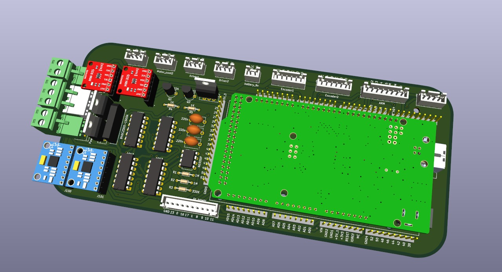

 

  

## 📋 About

Both PCBs were fully designed from schematic to layout in **KiCad** and manufactured as real printed circuit boards. The two boards work together: the Control PCB handles all logic, motor driving, sensing, and protection, while the Power PCB receives switching commands from the Control PCB and safely controls power delivery to the robot's subsystems.

## 🛠️ Tools Used

- **KiCad** — Schematic capture and PCB layout
- **Arduino IDE** — Firmware for the Arduino Mega

---

## 🟦 Control PCB

The brain of the robot. Hosts the microcontroller and all peripheral circuitry needed to drive motors, read sensors, and manage safe shutdown.

  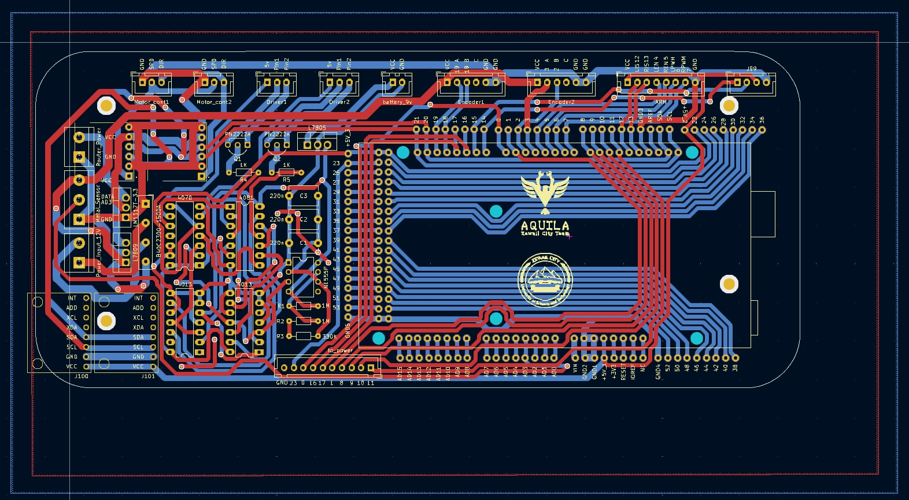

  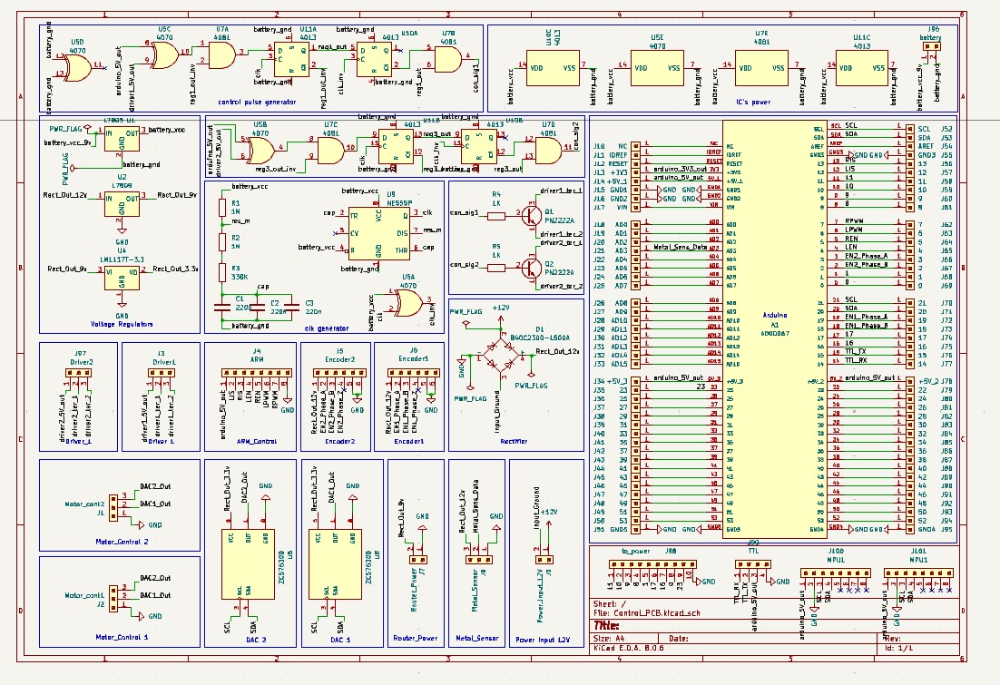

### Key Components

- **Arduino Mega** — Main microcontroller
- **Two HW-315 Motor Driver Modules** — Drive the main locomotion motors
- **H-Bridge** — Additional motor driving stage
- **Two MPU-6050 IMUs** — Inertial measurement units for orientation sensing
- **Auto Safe-Shutdown Circuit** — Capacitor-backed circuit using ICs, capacitors, and resistors that detects power loss and safely closes the system before supply rails collapse

### Connector Pins / Interfaces

| Interface | Description |
|-----------|-------------|
| Motor Control ×2 | PWM/direction signals for drive motors |
| Motor Driver ×2 | Power outputs to HW-315 modules |
| Encoder ×2 | Quadrature encoder inputs for wheel odometry |
| Arm Motor | Control signal for the mine-detection arm |
| 9V Battery | Main power input |
| Power PCB Link | Control signals sent to the Power PCB |

### PCB Photos

  

  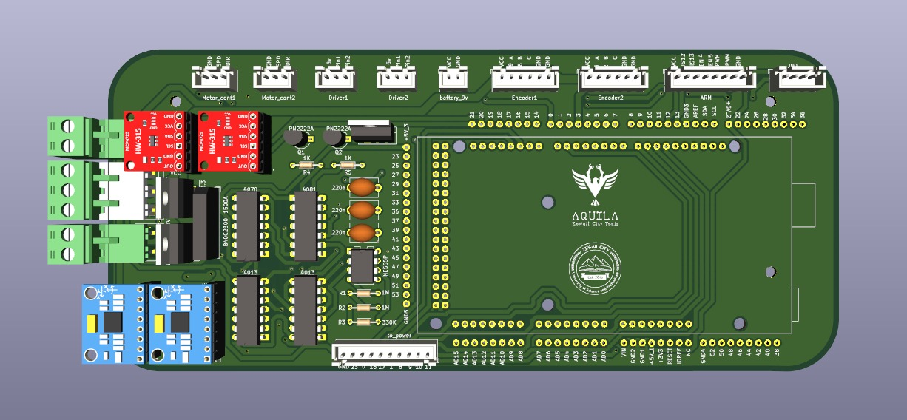
  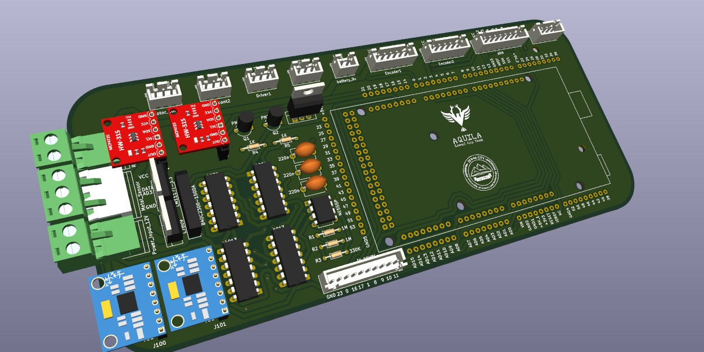
  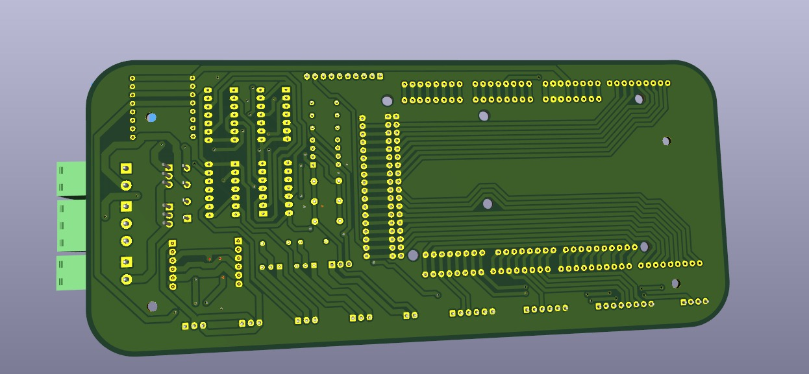

### Safe Shutdown Circuit

A key protection feature of the Control PCB is the automatic safe-shutdown circuit. When the power supply is cut or drops below a safe threshold, the capacitor bank holds enough energy to allow the ICs to complete a controlled shutdown sequence, preventing state corruption and protecting the motor drivers from abrupt power loss.

---

## 🟥 Power PCB

Acts as a smart relay board, receiving switching signals from the Control PCB and toggling power to the robot's subsystems in a safe, controlled manner.

  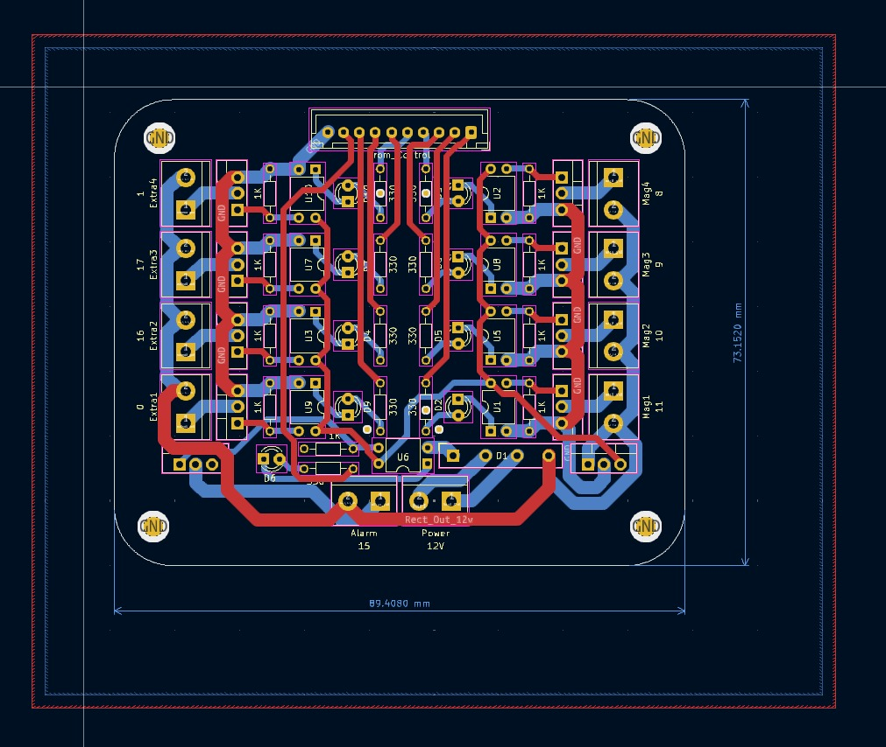

  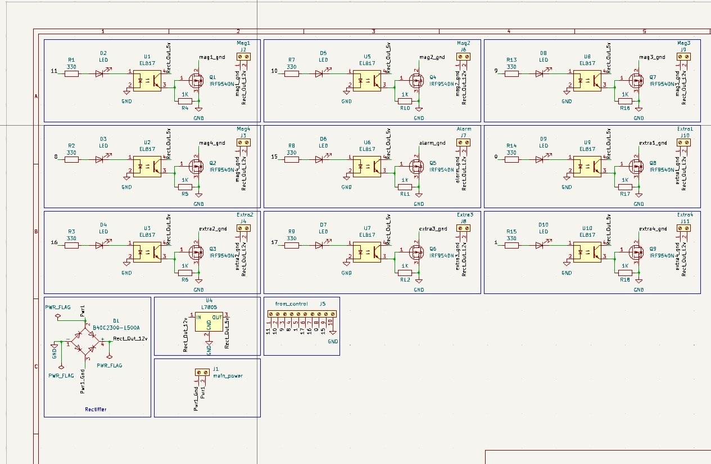

### Key Features

- Receives control signals from the Control PCB
- Safely switches power to robot subsystems on and off
- Protects against back-EMF and switching transients
- Designed for low-resistance power paths to minimise losses

### PCB Photos

  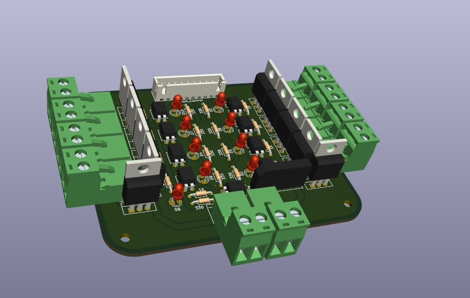

  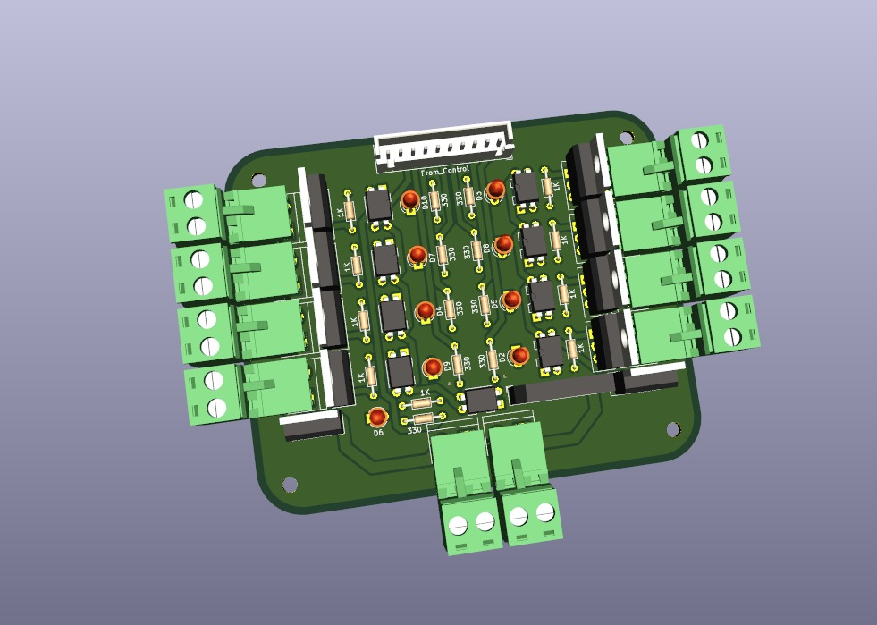
  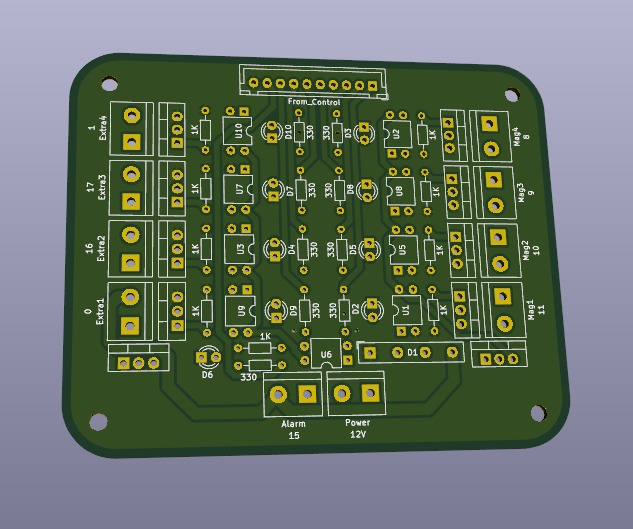
  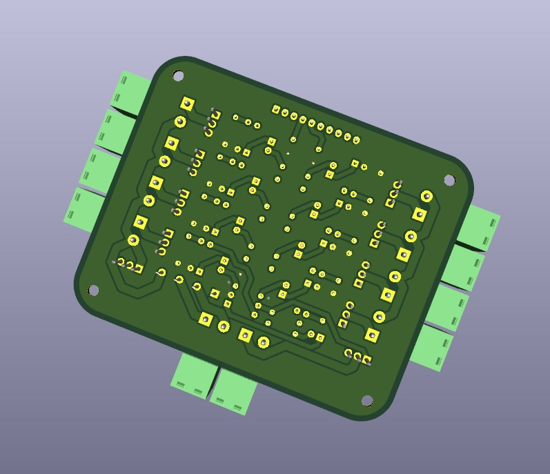

---

## 🖨️ Manufactured Boards

  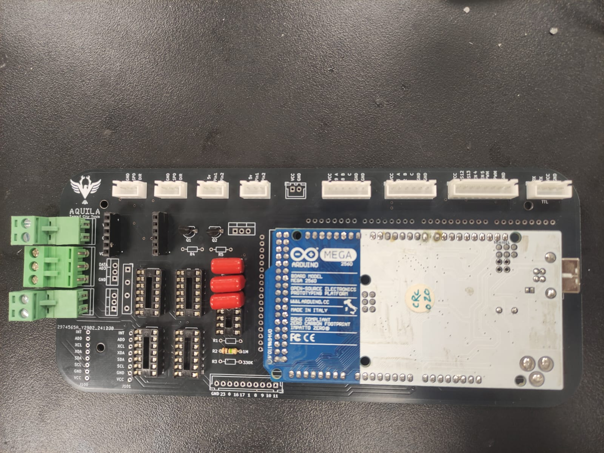

*Fully assembled and populated PCBs ready for robot integration*

---

## 📄 License

This project is licensed under the MIT License - see the [LICENSE](LICENSE) file for details.

## 🙏 Acknowledgments

- KiCad open-source EDA tool
- Competition organizers for the design challenge

## <!-- CONTACT -->

  <ul style="list-style: none">
    

      <h2 align="center">
        🚀
        CONTACT ME
        🚀
      </h2>
    

  </ul>

<table align="center" style="width: 100%; max-width: 600px;">
<tr>
  <td style="width: 20%; text-align: center;">
    
  </td>
  <td style="width: 20%; text-align: center;">
    
  </td>
  <td style="width: 20%; text-align: center;">
    
  </td>
  <td style="width: 20%; text-align: center;">
    
  </td>
  <td style="width: 20%; text-align: center;">
    
  </td>
</tr>
</table>
<!-- END CONTACT -->
